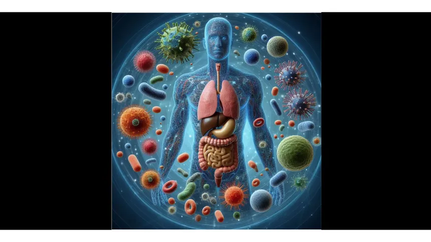
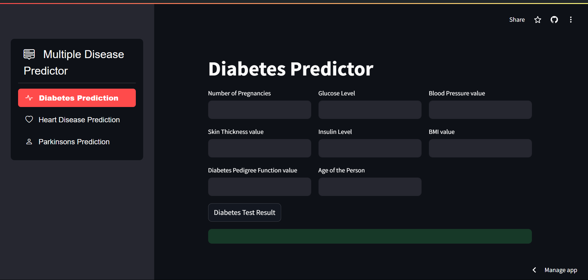

# Multiple Disease Prediction System

### Commands
1. For Creating Virtual Environments
    * conda create -p env python=3.9 -y
2. for Activating Virtual Environment
    * conda activate env/
3. For Installing Required Dependencies
    * pip install -r requirements.txt

4. For Pushing Code On Github
    * git init
    * git add .
    * git commit -m "commit massage"
    * git push -u origin main

## Model Deploy on Streamlit Cloud

* link :- https://multiple-disease-prediction015.streamlit.app/

## Here Is User Interface 

